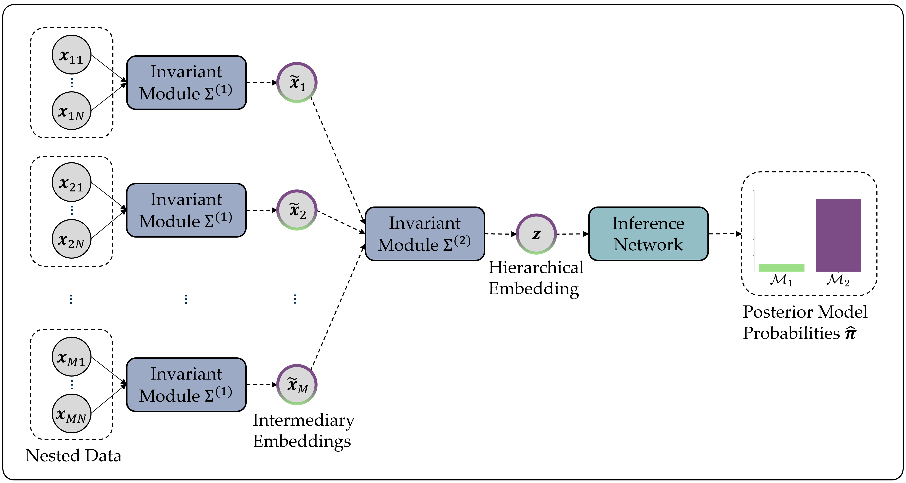

# Deep Hierarchical Model Comparison

This repository contains code for reproducing all results reported in the paper "A Deep Learning Method for Comparing Bayesian Hierarchical Models" by Lasse Elsemüller, Martin Schnuerch, Paul-Christian Bürkner and Stefan T. Radev (https://arxiv.org/abs/2301.11873).

## [notebooks](notebooks)

### [01_calibration_validation](notebooks/01_calibration_validation)

Code for reproducing the calibration experiments of validation study 1 that are composed of three sub-parts:
- [01_calibration_fixed_sizes](notebooks/01_calibration_validation/01_calibration_fixed_sizes.ipynb): Training and calibration assessment with data sets that all possess the same amount of groups and nested observations.
- [02_calibration_variable_observations](notebooks/01_calibration_validation/02_calibration_variable_observations.ipynb): Training and calibration assessment with data sets that all possess the same amount of groups but vary in their amount of nested observations.
- [03_calibration_variable_sizes](notebooks/01_calibration_validation/03_calibration_variable_sizes.ipynb): Training and calibration assessment with data sets that vary in their amount of groups as well as nested observations.

### [02_bridge_sampling_comparison](notebooks/02_bridge_sampling_comparison)

- [02_bridge_sampling_comparison/nested_models](notebooks/02_bridge_sampling_comparison/nested_models): Code for reproducing the bridge sampling benchmarking of validation study 1, in which the approximation performance of the neural network is tested against bridge sampling on a toy example.
- [02_bridge_sampling_comparison/non_nested_models](notebooks/02_bridge_sampling_comparison/non_nested_models): Code for reproducing the calibration experiment and bridge sampling benchmarking of validation study 2, based on the comparison of hierarchical SDT and MPT models.

### [03_levy_flight_application](notebooks/03_levy_flight_application)

Code for reproducing the application study in which two variants of the drift diffusion model are compared to two variants of a Lévy flight model. Consists of five steps:
- [01_simulator](notebooks/03_levy_flight_application/01_simulator.ipynb): Simulate training and validation data.
- [02_pretrain_networks](notebooks/03_levy_flight_application/02_pretrain_networks.ipynb): Pretrain the network on simulated data with a reduced amount of trials per participant.
- [03_finetune_networks](notebooks/03_levy_flight_application/03_finetune_networks.ipynb): Fine-tune the network on simulated data that contains the same amount of trials per participant as the empirical data.
- [04_validate_networks](notebooks/03_levy_flight_application/04_validate_networks.ipynb): Validate the trained networks on new simulated data sets.
- [05_apply_networks](notebooks/03_levy_flight_application/05_apply_networks.ipynb): Apply the trained networks to the empirical data set.

Here, we reanalyzed data from "Jumping to Conclusion? A Lévy Flight Model of Decision Making" by Eva Marie Wieschen, Andreas Voss and Stefan T. Radev. The data set can be requested from the authors of the original study.

## [src](src)

Contains custom [Julia](src/julia) and [Python](src/python) functions that enable the analyses, including our proposed hierarchical neural network architecture.
